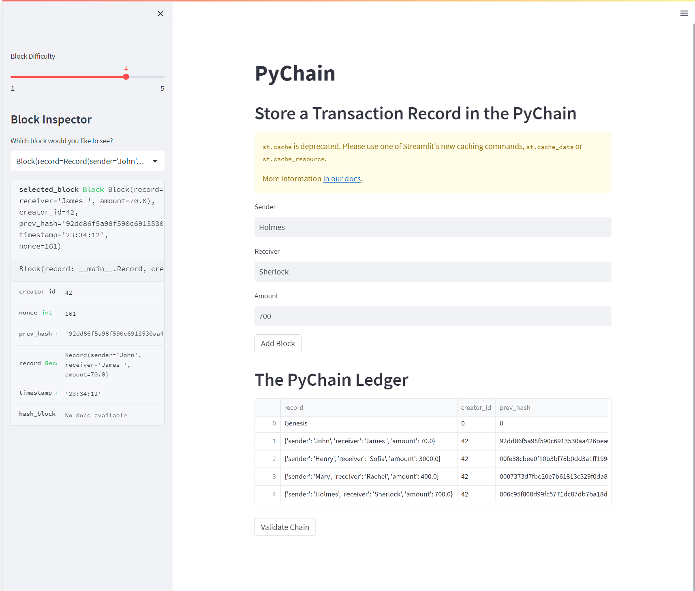
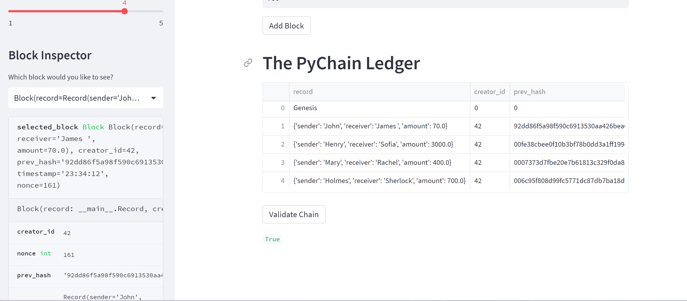

# Building a Blockchain-Based Financial Ledger
 
This project entails the development of a blockchain-powered ledger system featuring an intuitive web interface. It is being undertaken for the decentralized finance team of a prominent global bank. The primary objective is to facilitate secure financial transactions among partner banks, all while upholding the utmost integrity of the data stored within the ledger.

---

## Technologies

The technologies used in this project include:

   * [Streamlit](https://streamlit.io/) 1.23.1: Streamlit is an open-source Python library used to create web applications for data science and machine learning projects. 

   * [Python](https://www.python.org/) 3.7: Python is a versatile and widely-used programming language. It's the primary language for implementing the blockchain ledger and managing the logic of the application.

   * [Pandas](https://pandas.pydata.org/) 1.3.5: Pandas is a powerful data manipulation and analysis library for Python. 

   * [Hashlib](https://docs.python.org/3/library/hashlib.html): Hashlib is a Python library used for hashing data. In this project, hashlib is used to calculate the cryptographic hash of each block in the blockchain.

   * [Datetime](https://docs.python.org/3/library/datetime.html): Datetime is a Python library for working with dates and times. It's used to timestamp each block in the blockchain.


  
---

## Installation Guide

Open your terminal and run the command:

```python
  pip install -r requirements.txt
```

---

## Usage

To use this blockchain-based ledger system, follow these steps:

1. **Clone the Repository:** Clone this repository to your local machine using the following command:

   ```bash
   git clone https://github.com/AnaFilipaMartelo/Challenge18.git

2. **Run the Streamlit Application:** Open your terminal and run the Streamlit application with the following command:

     ```bash
    streamlit run pychain.py

3. **Input Financial Records:** In the Streamlit interface, you can input financial transaction records, including sender, receiver, and amount.

4. **Add Blocks:** Click the "Add Block" button to add blocks to the blockchain ledger. 

Do this several times to store several blocks in the ledger.
To ensure accuracy, review the block contents and their corresponding hashes in the Streamlit drop-down menu. 

Here's a screenshot of the web application:



5. **Block Validation:** Verify the blockchain's integrity by clicking the 'Validate Chain' button.  

Here's another screenshot of the Streamlit application:




---


## Contributors

* Ana Martelo (anafilipamartelo@gmail.com)

---

## License

MIT
